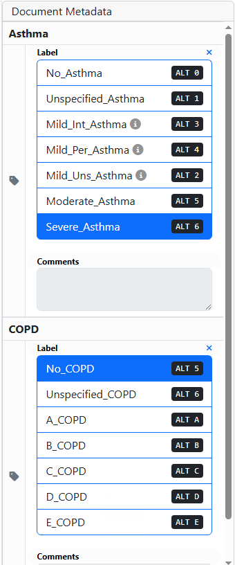

# Example Annotation Project

## Project Name
Identify XXXX Concepts from Pathology Reports

## Purpose of the Project
Explain the main idea what and why need to identify / classify text information

### Background
Broader background of the whole research project

## Harvest Time Tracking
Project Name in Harvest: XXXX

## Location of notes
- Annotation Tool: INCEpTION (accessible through web browser)
- A copy of this annotation guideline can be accessed through the INCEpTION interface.

## Estimated Time for Annotation
- Training: 20~40 hours per annotator
- Annotation round: 2-10 minutes per document (50-200 notes per round)

## Contact Information
- **Principal Investigator**: Dr. X Y., X.Y@va.gov
- **Clinical Expert**: Dr. X Y., X.Y@va.gov
- **NLP Team**: X Y., X.Y@va.gov
- **Annotation Team**: X Y., X.Y@va.gov

## Overview
Explain the goal of annotation task specifically

## Task 1

### Explain concepts:

1. Concept A
   - Definition:
   - Examples:
   - 
2. Concept B
   - Definition:
   - Examples:

### Explain attributes/modifiers:

### Explain document-level labels:

### Annotation Process

1. Highlight the entire phrase that indicates xxx diagnosis
2. Select the appropriate severity level from the *"Evidenc_type."*
3. Select the *"Temporality"* of the evidence.
4. Select the document level label, following the logic workflow as.... See image below:

## Instructions for Making Annotations

### Using the INCEpTION Annotation Tool

1. Log in to vhacdwdavdev04.vha.med.va.gov using remote desktop.
2. Use browser to navigate to vhacdwdavdev01.vha.med.va.gov:8086.
3. Log in to INCEpTION with your provided credentials.
4. Open the assigned project: XXXXX (each round will have a different name).
5. Select a document from the document list
6. For snippet-level annotation:
   - Select the relevant text span in the document
   - In the right panel, select the appropriate evidence type from the dropdown or use hotkeys.
   - For each evidence annotation, specify the temporality (Current, Historical, or Hypothetical)
7. For document-level annotation:
   - Look in the left panel for document-level classification options
   - Select the appropriate label for document categories
8. Once finishing annotating a note, tag the status button to mark the note as completed.

## Appendix: Example Annotations
